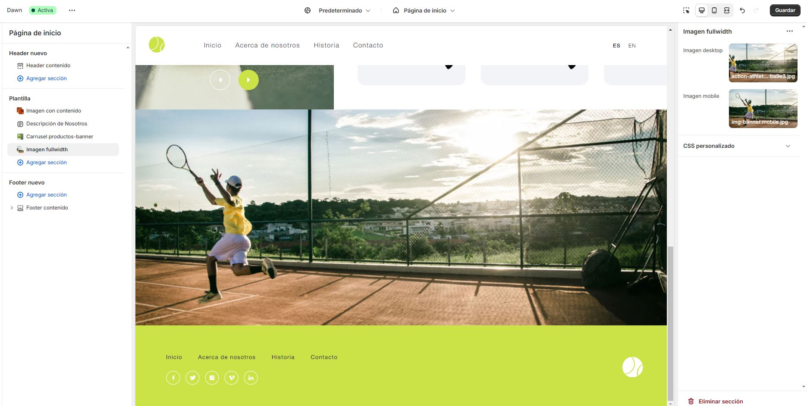

# Prueba Maquetacion Shopify AlejandroEspinoza

URL: https://prueba-practica-getmore-ae.myshopify.com/
Contraseña: GAER28

# El proceso que se llevó a cabo para realizar el sitio fue:

1.- Se creó la tienda con el tema default, se borraron todos los elementos del tema dejando solo lo necesario por Shopify para funcionar.

2.- Se crearon nuevos archivos JSON para el manejo de un Heade Y Footer, son su respectivo template LIQUID para la maquetación de las variables.

3.- Se agregaron tipografias a través de archivos TTF de acuerdo a lo señalado en la propuesta gráfica

4.- Todas las secciones se crearon con archivos LIQUID para un mayor manejo del sitio

5.- Se adecuó la maquetación y diseño para una vista exacta de acuerdo a la propuesta gráfica en versiones Desktop

6.- En mobile se desarrolló la funcionalidad del menú para que se muestre oculto

7.- Se utilizó la libre SWIPER para crear el carrusel

8.- Se cargaron productos en shopify y se mandaron a llamar en el template

# Agrego imagenes del backoffice de cada sección

Header:

Footer:

Sección 01 (Banner):

Sección 02 (Nosotros):

Sección 03 (Carrusel productor):

Sección 04 (Imagen de ancho completo):

